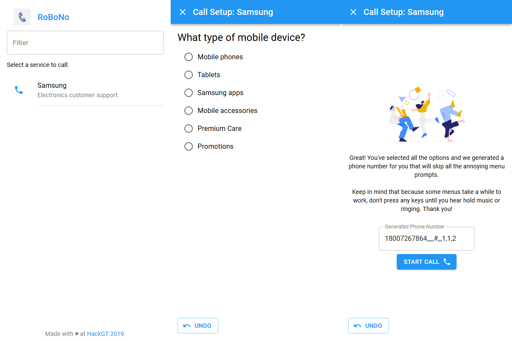

# RoBoNo

## Skip the robots and get to the point.

App-based navigation for touch-tone menus.

To see it live, check out:
https://robono.tech

### DevPost Description

This project was created for HackGT 2019. Here's the full summary of this project, copied from our [DevPost](https://devpost.com/software/robono):

### Inspiration

_If you are calling to provide feedback, press "1". If you are calling to report an outage, press "2". If you are a new customer, press "3"...._

These menus ('touch-tone menus') are present in some form in nearly every large organization in the world's customer support phone systems. Many accept them as a fact of life, but they are an incredibly bad user experience. Imagine if you had to use the menus on your phone by slowly scrolling through each option, in order, tapping the correct option as it goes by. Image if that menu was also blurry, because often these systems are staticy and difficult to understand.

A touch-tone menu can take several minutes to navigate through and can even require a user to completely start over if they make a mistake. And it's worse than just inconvenience - imagine how difficult a menu like this would be to navigate if you are hearing-impaired or don't have the ability to remember several menu options as more are read without pause.

This is why we have created _RoBoNo_.

### What it does

RoBoNo is an app that allows users to use simple and readable text-based menus to navigate touch-tone menus. Once the user selects all of their choices, RoBoNo provides them with a number to call that skips all of the prompts automatically. A touch-tone menu that would take several minutes to navigate can now be completed in just seconds.

RoBoNo also has full undoing capability, so there's never a need to start over if a mistake is made.

### How we built it

This app is a responsive web site that looks and feels like a native application. On the front end, React is used with the Material-UI components library to create a site that responds quickly to new data and has the same look and feel as other apps. By taking advantage of React's powerful state management, we were able to quickly create an app and spend much less time writing complex DOM-manipulation code in JavaScript. 

The entire app is built in TypeScript, with then compiles to JavaScript before being sent to the user. Because programming at a hackathon is performed under such a short time and often without much consideration for future maintainability, TypeScript's static type checker provided invaluable in keeping our code clean and helping us find bugs before they ever made it to the website. All of our code was also checked with ESLint and formatted with Prettier to help keep things consistent and clean.

On the server side, we used a simple Node server to serve the React website. The same server provides `/api/callees` and `/api/menus/:menuID` endpoints with the use of the popular Express routing framework. These endpoints serve plain JSON and are used by the app's frontend to dynamically load data. This way, we don't load all the data at once and use excessive memory or network resources.

The data is stored in a MongoDB NoSQL database. The NoSQL technology was great for a small project like this, where we don't anticipate storing massive amounts of interconnected data and therefore don't need the overhead of a complicated SQL setup. Both the database and Node server are hosted on Google Cloud. The Node server is hosted with Google's App Engine.

### Challenges we ran into

One of our biggest challenges was collecting the data to use for the site. Because this hackathon was on a weekend and so much of the coding was late at night, it was difficult to find customer service lines that were active during hacking time. Also, the collection process is tedious (because we have to contend with touch-tone menus) and requires calling a number of times to find all the options.

We also ran into some issues with the server aspect of the project. We originally were planning to use a SQL database and spent significant time working on setting it up before we realized that MongoDB would be much more effective for our particular use case. When deploying to Google Cloud, we had to write some custom deployment scripts in order to be able to link the React frontend (which has its own package.json and runs with Webpack) using an Express server.

### Accomplishments that we're proud of

We are really proud to have created a complete, working minimum viable product (MVP) in just one weekend. While it doesn't have tons of features or data yet, the code is clean and the site structured in such a way that it would definitely be feasible to continue to develop this idea.

We also are proud to have created a clean and intuitive user-interface. The UI design side of a project is always challenging and nuanced, but we think that RoBoNo's interface is easy and enjoyable for anyone to use.

### What we learned

We learned how to keep the scope of a project down in order to make significant progress without getting sidetracked. Rather than try to complete every feature we thought of in a single weekend, we targeted making a functioning and bug-free app that could serve as a core to easily implement those features, and we did it. By focusing on the core functionality, we were able to design, code, and deploy a fully functional, useful, and unique application in just one weekend.

From a technology standpoint, this was the first time any of the team members had worked with a NoSQL database and three of the four members were new to web development. Therefore we all had to work hard to develop our skills to make this happen.

### What's next for RoBoNo

We have a ton of ideas for new features we'd like to implement. Here are some of them:
* Add capability to enter custom text and numbers
* Add indicators as to whether a customer service number is currently open or not
* Add significantly more phone numbers to the database
* Develop a robot that automatically calls numbers and collects data about their menus (like a web scraper for phones)
* Improve the flow after the call setup process completes (perhaps by using native Android APIs to access the phone app)
* Add full progressive web app (PWA) support so the website acts just like a normal app when saved to the home screen
* Change icon colors per phone (to match the organization's brand) and then change the app bar color based on the service that was clicked
* Add transitions between questions to make it feel smoother
